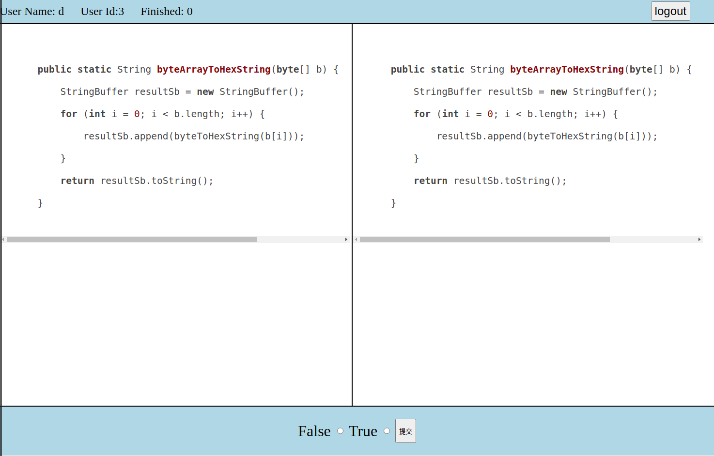
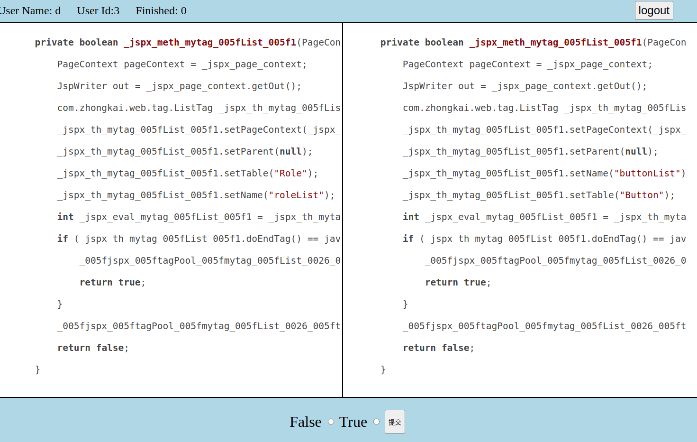
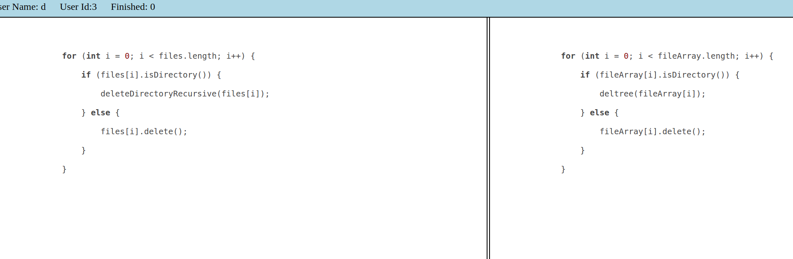
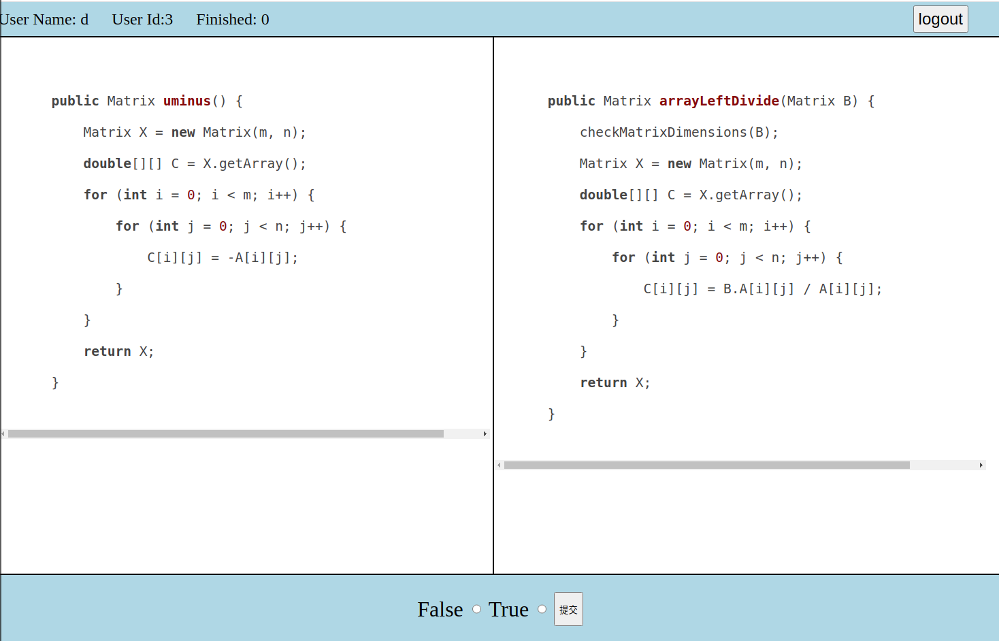
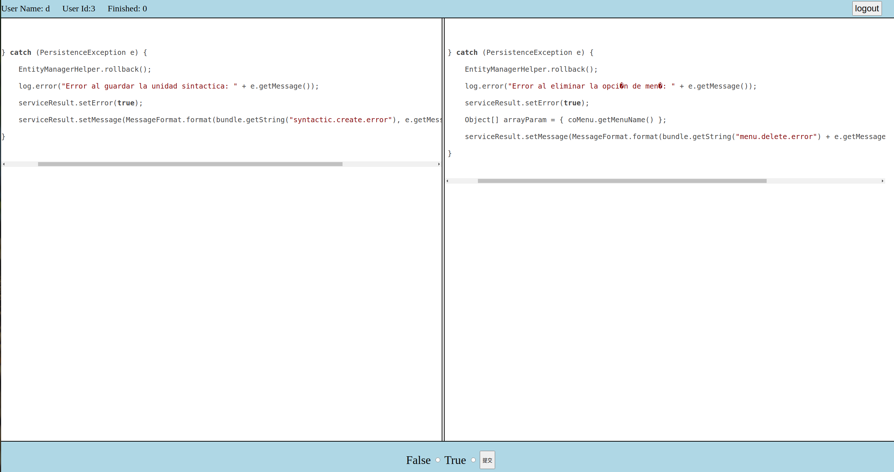

# MSCCD精度評価実験　説明

## システムへの接続

　セキュリティの配慮で、URLとアカウントは個別に配布する。

## システムの使用

1. 登録すること  
   + 渡された番号を入力して、ログインをくりっくしてください。  
   + 入力ミスなどにより登録失敗した時に、自動的にログインページへ戻るので、もう一度やってください。

2. クローンの判定  
   + 画面の上に、JuderId、お名前、完成した判定の数を提示している。ご確認ください。
   + 画面の中央には、二つのコード片を展示している。クローンであるかを判定してください。
   + 確認後、画面のしたにあるFalse、Trueのチェックボクスをクリックして、提出のブタンを押してください。
   + 判定しかねるケースであれば、'neutral'を選択して提出していい（コメントあればよろしく）。　ページをリロードして直接に次のペアに進んでもよい。

3. ケースの切り替え
   + 結果提出後、自動的に次のペアに進む。
   + ページのリロードによりも、新しくペアに移行できる。
  
4. ログアウト
   + 作業が一時終わる時に、右上のログアウトをクリックするとログアウトできる
   + 予定の判定数に達したら自動的にログアウトする（お疲れ様でした！感謝します！） 
  
## デカイコード片の対応

今回はクラスや全ファイルのケースもあり、このWeb Appの画面に見にくいと思う。VsCodeのようなEditorにコピペするのはお勧め  
下記の正規表現で書き換え機能を利用して、簡単にコメント削除することができる
>　/\*(.|[\r\n])*?\*/

「remove comments」のようなEditor Extensionもあり、活用してください
## コードクローンの判断基準

1. レイアウト以外全部一致するコード片はコードクローンになる
   
2. 1の上、識別子、変数、リテラルの修正があるコード片もコードクローンになる
   
   
3. 2の上、ステートメントの削除、追加、修正のあるコード片、大体同じ機能であればコードクローンになる
   
   
4. 不確定であるば、リロードし、またはneutralにしてください
5. それ以外は、Falseになる

